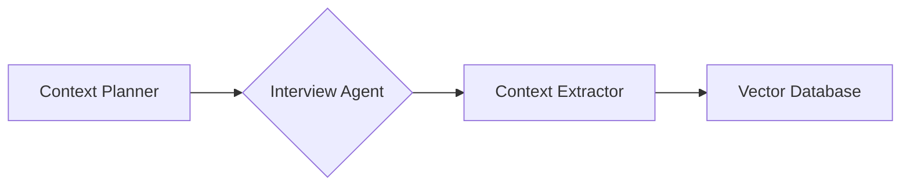

## Workflow Examples

**Workflow 1: Building a Contextual Data Knowledge Store from Scratch**

1.  Start with the **Context Planner** to identify key areas for context development (e.g., career aspirations, skills, personal interests).
2.  Use the **General Interviewer** or **Gap-Filler Interviewer** to conduct interviews and generate context snippets for each area.
3.  Employ the **Context Extractor** to refine and format the interview data into structured context snippets.
4.  Store the context snippets in a **Vector Database**.

**Workflow 2: Enhancing Existing AI Agents with Contextual Data**

1.  Use the **Context Extractor** to extract relevant information from existing documents and data sources (e.g., resumes, social media profiles, meeting notes).
2.  Store the extracted context snippets in a **Vector Database**.
3.  Connect the **Vector Database** to your AI agents, enabling them to access and utilize the contextual data for more informed and personalized interactions.